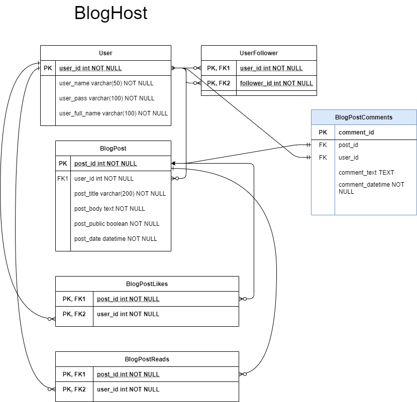
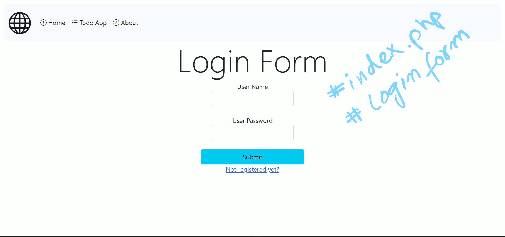
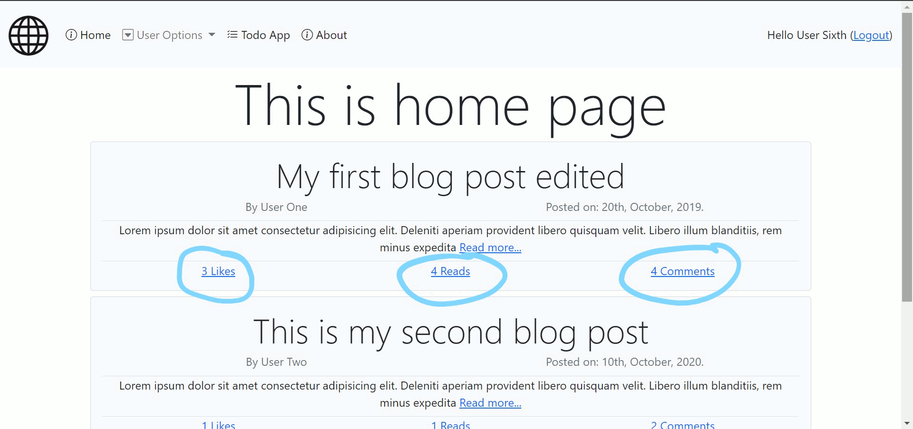
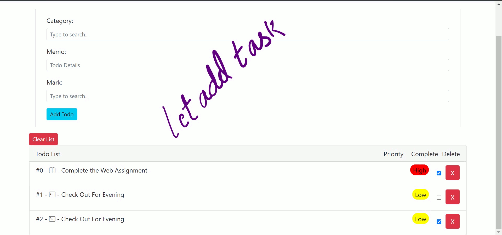
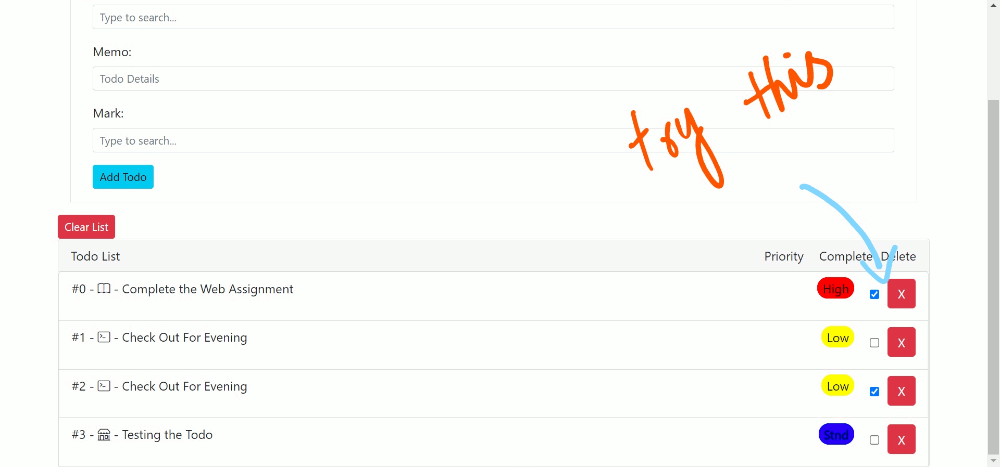
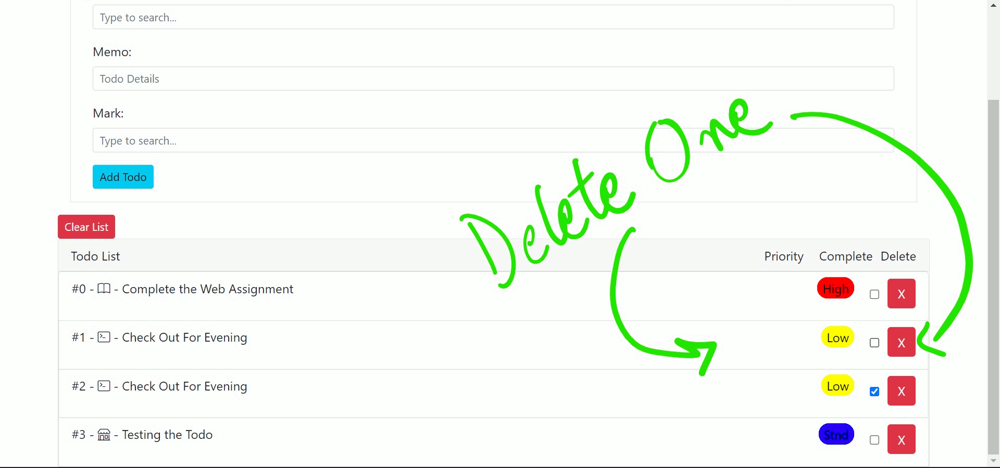

# BlogHost and Todo Web Assignment

## Implementations

1.  Like and Dislike functions.
    - On .../post.php page registered users can like and dislike the post.
2.  Add New or Edit Posts.
    - Registered user can post new articles and can edit as well.
3.  Enable and disable public visibility.
    - Users can control the visibility of their post.
4.  Read Posts.
    - Read count will be updated by +1 when unique user reads post first time only.
5.  Comments.
    - New comments on post.
    - Comments read section on post page.
6.  User Profile.
    - Shows totall likes.
    - Shows totall Comments.
    - Shows totall Posts Count.
7.  Registration.
    - User can register with unique name only.
8.  Todo Session based with following features
    - Categorised Tasks
    - Custom Prioritised Tasks
    - Checkbox to mark completion.
    - Delete Button to remove task.
9.  **Converted README.md into Raw HTML** using [Web Tool (Link).](https://markdowntohtml.com/)

## How to setup and run the code

Clone this repo using git clone https://github.com/rajBinMoti/webAssignemnt2021 in htdoc. There is a file dbSetup.php in root directory, which will generate a dummy database with some record to test the blog side of application. Run it on localhost using http://localhost/blog-host/install.php url.

Note! To safe remove the dummy database: http://localhost/blog-host/uninstall.php

## Updated ERD

## How to run the application

Open browser and visit http://localhost/blog-host and test it on local server.
One copy of this code is also deployed on live server at https://2k18-csm-84.000webhostapp.com/

## Odds

- Some logical fixes are still pending to do...will fix soon.

## Glimpse

### Login Steps

### Read, Like, and, Comment on Post

### Add Task

### Update Task

### Delete Task

